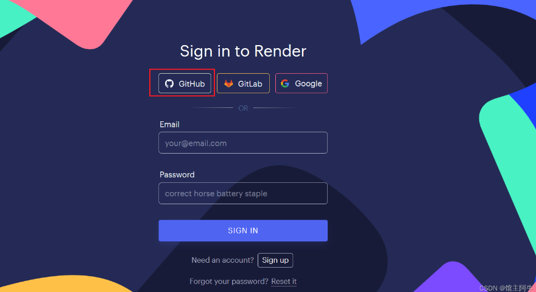
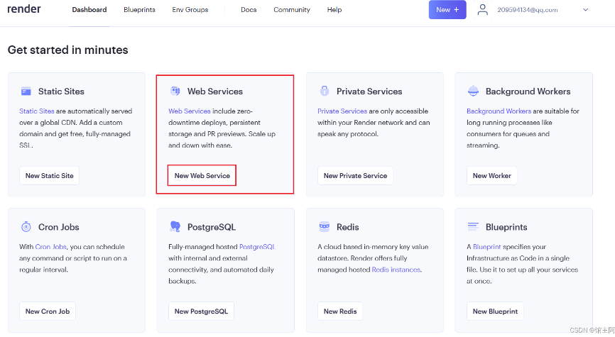
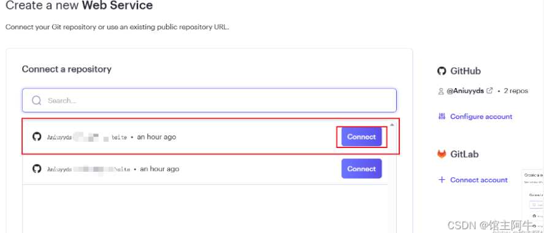
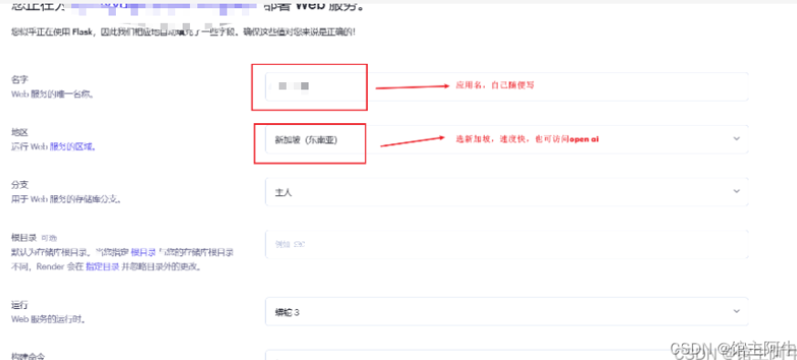
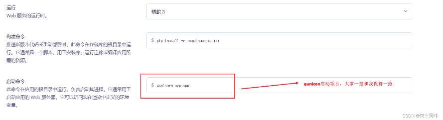
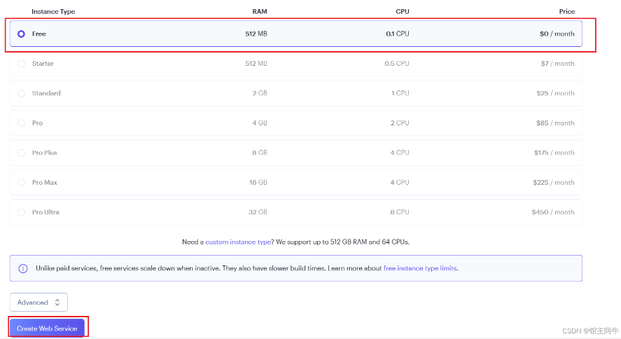
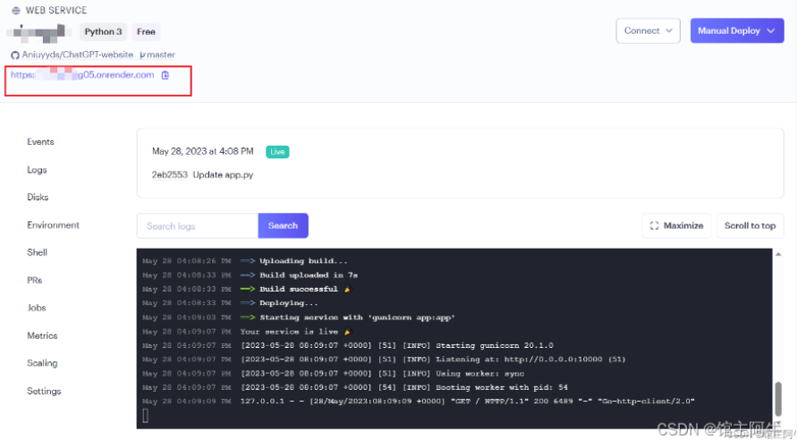
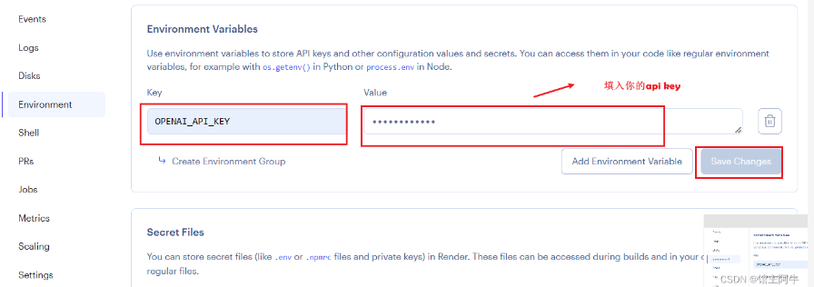
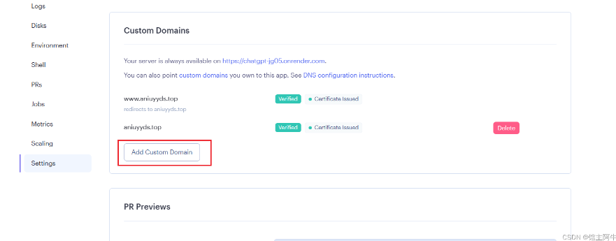
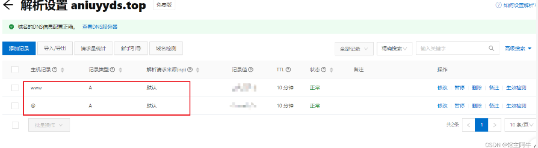

# 前言
我的开源小项目ChatGPT-website是基于flask框架做的后端，而许多人也没有自己的服务器，并且市面上也很少有paas平台可以免费部署python项目的，大多是node.js项目，因此，本篇博客将介绍如何用render平台搭建开源小项目ChatGPT-website，一次部署，自动持续更新！(由于之前平台教程被下架，迁移到这)

## 已尝试的云平台对比
花费时间探索了很多平台，以下是一些对比：

平台 | 说明
----- | -----
Vercel  | 主要部署前端项目，有python支持，但部署python项目文档一点也不详细，只能部署helloworld，没有尝试成功该项目的部署
Deta | 对node.js和python项目十分友好，并且永久免费，该项目尝试已部署成功，但未实现流式响应，并且流式响应最大持续10秒，即10,秒的http连接，无奈放弃！
Heroku | 对各种语言都支持，但注册很麻烦，注册完成后需要手机下载一个谷歌的软件生成注册验证码，我搞好了，但用的时候发现免费计划需要绑定visa信用卡才可以用，又是白忙活一场。
render | 最后尝试的，可以部署，一个月750小时，就是31天，简直完美，但最大只能流式响应30秒，不影响，输入“继续”让 AI 继续输出就行！

其实还有很多对`python`项目很友好的平台，像 fly ,  railway等，但这些平台免费计划一个月只能用20天左右！因此，我最终还是选择了`render`平台！

需要注意的是这些平台都是国外平台，如何用就不用我说了吧，当然`render` 国内也是可以访问的！

## 搭建教程
`render`平台需要 `github` 登录导入自己的仓库项目部署，因此我将`gitee`项目在`github`镜像了一份，并做了稍微的修改以用于`render`平台部署！

仓库 | 地址 | 说明
----- | ----- |------
原仓库gitee | [gitee仓库](https://gitee.com/aniu-666/chat-gpt-website) | 有自己服务器的用这个
github镜像 | [github镜像](https://github.com/Aniuyyds/ChatGPT-website) | 没服务器的使用这个仓库，本篇博客的教程也是这个

首先访问我的此项目的`github`仓库，然后`fork`此项目到你的仓库！这样我有任何更新，你也可以同步自动部署！

然后登录`render`平台 ： https://dashboard.render.com/
关联`github`仓库登录，用于一键部署！

然后点击新建网络服务

然后导入你刚刚 `fork` 的`github`仓库项目部署！

进入后就是部署配置，大家翻译一下或者和我的保持一致就行

然后选择免费的，最后创建应用服务就行！

然后等待部署成功，可以看到为你的项目分配了二级域名

别急，还需要在环境变量中添加你的 openai apiKey

最后保存就行，以后更换 apikey 在这里更换就行！

当然也可以添加自定义域名：

需要你将域名解析到他给出的ip中，到你购买域名的云服务商的控制台添加解析记录就行

然后等待一会儿，就可以访问啦！

## render平台的优点与缺点

其他详细信息可以看他们的官方文档，这里我说一下与此项目相关的！

- `render` 平台运行项目的机制时，当一段时间你的项目没人访问，会关闭服务，当有人访问时又会自动重启，所以免费时间完全够用！

- 你更改仓库项目后，会自动帮你重新部署，很方便！
- 最大http连接为30秒左右，所以只能流式响应30秒，但毕竟免费的，也不影响使用，你输入“继续” 让 `ChatGPT` 继续输出就行！
- 服务器本身是国外的，可直接访问AI官方接口，不用代理！
